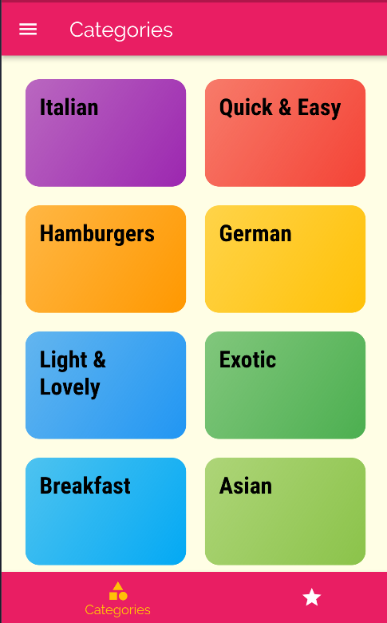

# MealsApp

Small app, made during the Flutter Course

---

## What is it?
It is a simple mobile appliaction which contains basic cooking recipes - Made with Flutter.


## Preview




## Run Locally

Clone the project

```bash
  git clone https://github.com/NotSoYeezy/Flutter-MealsApp.git
```

Go to the project directory

```bash
  cd Flutter-MealsApp
```


Run App with Flutter

```bash
  Flutter run
```

